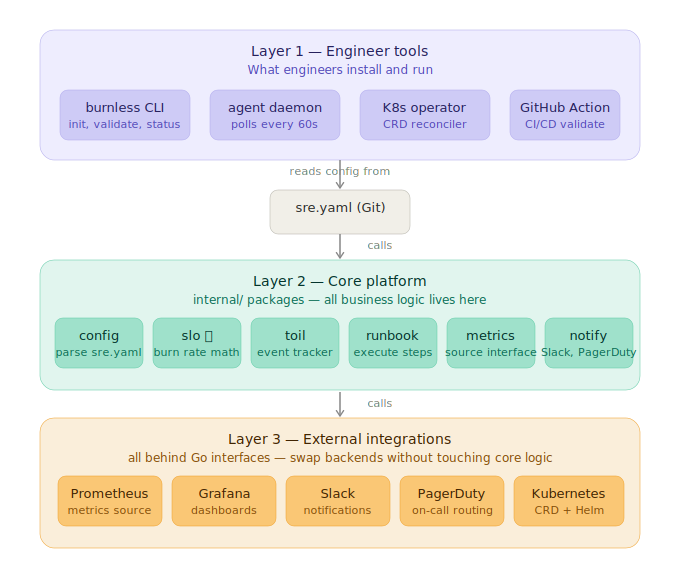

# Burnless Architecture

## Overview

Burnless is structured in three layers:
+---------------------------+

|    Engineer Tools         |  cmd/burnless, cmd/agent, cmd/controller

|    (CLI, Agent, Operator) |

+---------------------------+

|

v

+---------------------------+

|    Core Platform          |  internal/config, internal/slo,

|    (internal/ packages)   |  internal/runbook, internal/metrics,

|                           |  internal/notify, internal/toil

+---------------------------+

|

v

+---------------------------+

|    External Integrations  |  Prometheus, Grafana, Slack,

|    (behind interfaces)    |  PagerDuty, Kubernetes

+---------------------------+

## Data Flow
sre.yaml (Git)

|

v

burnless agent

|

v

Prometheus (metrics source)

|

v

internal/slo (burn rate calculation)

|

+----- burn rate OK -----> continue watching

|

+----- burn rate HIGH ---> internal/runbook (execute steps)

|

+--> internal/notify (Slack/PagerDuty)

+--> audit log

## Package Responsibilities

| Package | Responsibility |
|---------|---------------|
| `internal/config` | Parse and validate sre.yaml |
| `internal/slo` | Error budget math, burn rate calculation |
| `internal/toil` | Toil event storage and reporting |
| `internal/runbook` | Execute remediation steps |
| `internal/metrics` | MetricsSource interface + Prometheus impl |
| `internal/notify` | Notifier interface + Slack/PagerDuty impl |
| `pkg/types` | Public Go types for sre.yaml |
| `pkg/sdk` | Public Go SDK for integrations |

## Key Design Decisions

1. **sre.yaml is the single source of truth** — all config in Git
2. **internal/ packages are independent** — no cross-imports
3. **Interfaces for everything external** — swap backends without changing core
4. **CLI is thin** — all logic lives in internal/, CLI just wires it together

See [DESIGN_DECISIONS.md](DESIGN_DECISIONS.md) for the full reasoning.
